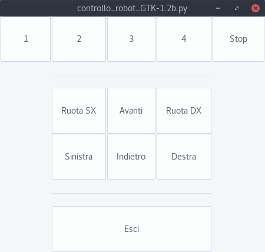
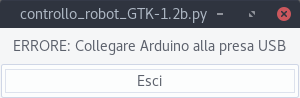

# Arduino_Control-Robot-from-PC

This is an Arduino project to command a robot with a python GUI with an USB cable
  
<b>Dependencies</b> 
-python2.7
-python-glade2
-python-serial

Debian and Ubuntu 
sudo apt-get install python2.7 python-serial python-glade2
  
<b>INSTALL</b> 
Install "robot_manuale.ino" into Arduino, then (with USB cable plugged) launch the client software "controllo_robot_GTK-1.2b.py" and select the command that you want
  
Screenshots of Client Software (python)
  

  

